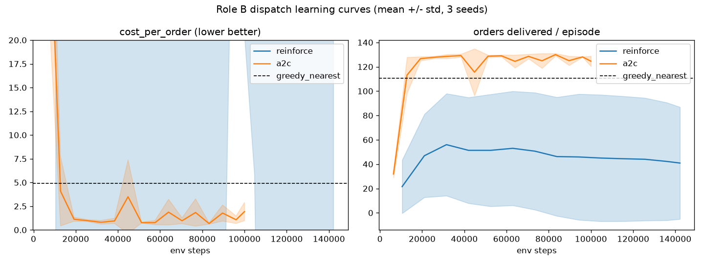
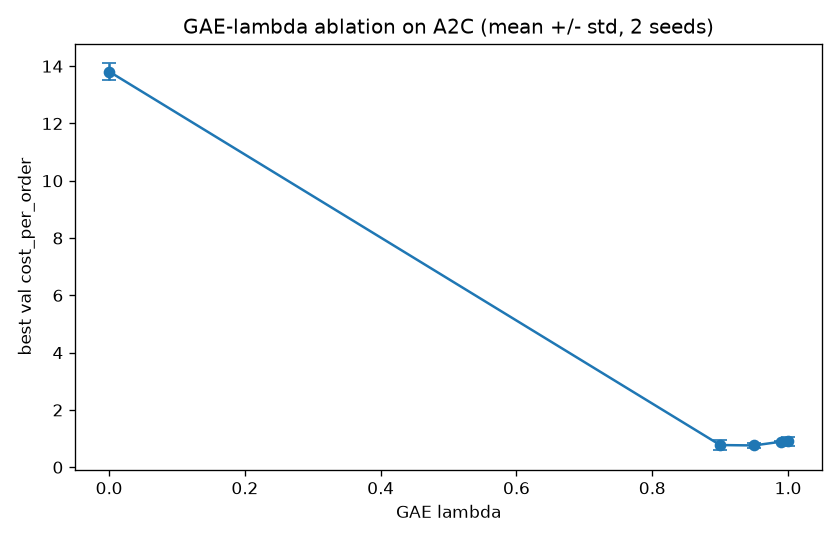
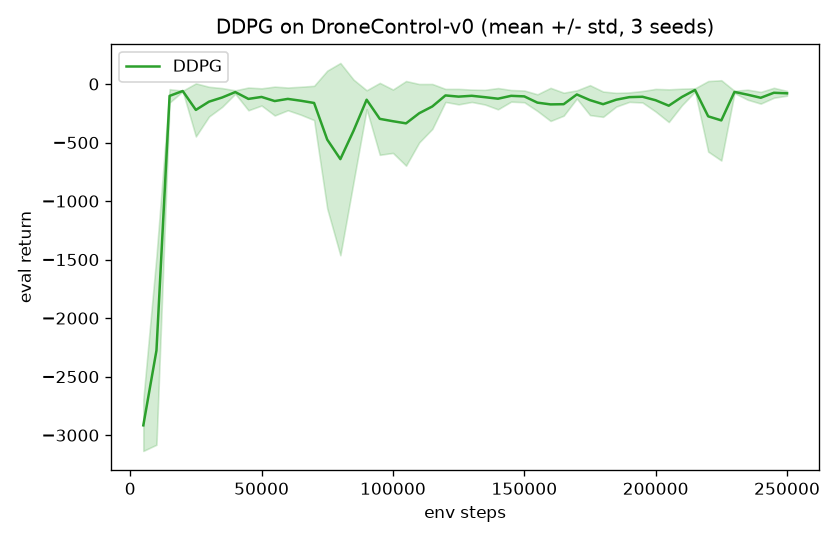

# IE 306 Term Project — Reinforcement Learning for City-Scale Drone Delivery

**Team:** Sezen Balkan (Role A), Ozan Karhan (Role B), Tuba Nur Büyükata
(Role C). Offline RL and multi-agent control are joint components.

The primary metric is mean `cost_per_order`; lower is better. Unless stated
otherwise, the final table uses `configs/eval_standard.yaml` and environment
seeds 0, 1, and 2. It is reproduced with:

```bash
python run_all.py --config configs/eval_standard.yaml --seeds 0,1,2
```

## 1. Baselines

| Policy | cost/order, mean ± std | success rate |
|---|---:|---:|
| random | 18.78 ± 1.27 | 0.653 |
| **greedy_nearest** | **4.57 ± 0.85** | 0.855 |
| milp_rolling | 4.72 ± 1.38 | 0.836 |

`greedy_nearest` is the required bar. MILP is slightly worse on these seeds
because its single-epoch Manhattan-distance matching can make poor assignments
around no-fly geometry.

## 2. Role A — Value-based methods (Sezen Balkan)

### 2.1 Methods

The first implementation used a flat observation vector and a replay-buffer
DQN. Invalid actions were masked both during action selection and Bellman
backup. We then introduced Double DQN to separate next-action selection from
target evaluation, Dueling DQN to separate state value and action advantage,
and three-step returns to improve delayed credit assignment.

The flat network remained unstable and did not beat greedy. The final Role-A
method is therefore a **factored Double DQN**. Shared heads score every
drone-order assignment and every charging action. Features include routed
pickup/delivery distance, deadline feasibility, battery feasibility, current
SoC, and global demand. The network is warm-started by supervised imitation of
the Role-C depth-1 planner, then updated using replay, a target network, and
Double-DQN TD targets. The warm start is disclosed because presenting it as a
from-scratch DQN would be misleading.

### 2.2 Results

| Value-based method (3 training seeds) | cost/order | success |
|---|---:|---:|
| DQN n=3 | 20.67 ± 6.57 | 0.495 |
| Double DQN n=3, flat MLP | 6.76 ± 1.80 | 0.749 |
| Dueling DQN n=3 | 26.07 ± 3.49 | 0.428 |
| Factored, warm-start only (0 TD steps) | 3.28 ± 0.16 | 0.872 |
| **Factored Double DQN, best checkpoint** | **2.29 ± 0.41** | **0.883** |

**Baseline comparison (standard eval config).** Per deliverable 5, the shipped
value-based method is compared head-to-head against all three required
baselines on `configs/eval_standard.yaml`, eval seeds 0–2:

| Policy | cost/order, mean ± std | success |
|---|---:|---:|
| random | 18.78 ± 1.27 | 0.653 |
| greedy_nearest | 4.57 ± 0.85 | 0.855 |
| milp_rolling | 4.72 ± 1.38 | 0.836 |
| **Factored Double DQN (3 seeds)** | **2.29 ± 0.41** | **0.883** |

The factored Double DQN beats `random`, the required `greedy_nearest` bar, and
`milp_rolling` on both cost and success.

**DQN → Double DQN → Dueling DQN (flat assignment env).** The figures below are
the required ≥3-seed mean±std learning curves for the three flat value-based
variants at 600k steps, on both metrics. Double DQN (orange) is the clear winner
of the family: lowest `cost_per_order` with the tightest seed band (~16–22) and
the highest `episode_return`; plain DQN (blue) is noisier and ~5–10 cost worse;
Dueling DQN (green) is the weakest — highest cost, lowest return, and the widest
±std band (spiking past 40). This ordering is exactly why the flat line was
carried forward as Double DQN rather than the dueling variant.


Crucially, *none* of the three flat variants approaches the greedy bar of 4.57:
they all plateau around 16–22 cost. Extending the best one (Double DQN) to 3M
steps confirms both the ceiling and the failure mode — it dips into a good
~9–10 band between roughly 1.0M and 2.0M steps but never stably beats greedy and
then **diverges back to ~30** by 3M. This is the value-based bootstrapping
instability that motivated replacing the flat representation with the factored
Double DQN.


The TD learning is not cosmetic on top of the warm start. With 0 TD steps the
network is a pure imitation of the Role-C depth-1 planner; it already beats
greedy at **3.28 ± 0.16**, but Double-DQN training lowers cost to
**2.29 ± 0.41** at 5,000 steps — a consistent ~30% reduction in *every* seed
(3.26→1.72, 3.09→2.65, 3.49→2.50), not a single lucky run. The value updates
add real improvement over the demonstrator rather than replaying it.

The weakness is stability, not contribution. Pushing all three seeds to 10,000
steps collapses them to ~32 mean cost (26.2, 33.1, 36.3) with negative return.
Training guards against this by saving only on validation improvement
(`save_policy` fires when `cost_per_order` drops), so the saved file is the
5,000-step checkpoint by construction — not a manual pick — and re-running
training reproduces the same selection. The single saved model (training seed 0)
scores **1.72 ± 0.05** over eval seeds 0–2, and `run_all.py` loads exactly that
file.


### 2.3 Required ablation: target network (on the shipped factored method)

The required ablation is run on the factored Double DQN we actually ship, not on
a discarded flat model. Both runs use the same seed and the identical Role-C
warm start (step-0 cost = 3.26); they differ only in the target-network delay —
ON copies the online weights to the target every 1,000 steps, OFF copies them
every step (no delayed target). Config: `configs/factored_double_dqn.yaml` vs
`configs/factored_double_dqn_notarget.yaml`.

| Setting | cost @ 5k steps | cost @ 10k steps |
|---|---:|---:|
| **Target network ON** (shipped) | **1.72** | 26.23 |
| Target network OFF | 26.57 | 24.65 |

The effect is decisive. With the delayed target ON, TD training improves the
warm start from 3.26 down to **1.72** (beating greedy) before its late
divergence, so a validation checkpoint is recoverable. With it OFF, training
**immediately destroys** the warm start — cost collapses to 26.57 by 5k steps
and never recovers, and the factored method produces no greedy-beating
checkpoint at all. The delayed target is therefore not a minor stabiliser but a
precondition for this method to learn. This isolates bootstrapping instability
as the failure mode, and is consistent with the same ablation on the earlier
flat Double-DQN (ON also beat OFF there, best 10.19 vs 13.18).

### 2.4 What broke

The original flat representation mixed a 20×20 grid with entity rows and a
large action head. It learned passive charging/no-op behavior and later
diverged. Increasing training to millions of steps did not fix the
representation. Factored action scoring supplied the relational information
needed for assignment. Even then, TD learning could destroy a good warm start,
which is why validation checkpoints and three training seeds are reported.

On individual ownership: the warm start borrows the Role-C planner as a
demonstrator, so the warm-start number (3.28) is not independent of Role C. The
individually-owned value-based contribution is the rest — the factored action
architecture, the **3.28 → 2.29 improvement the Double-DQN updates produce in
every seed**, and the instability-and-checkpointing diagnosis. Presenting the
warm start honestly is deliberate; the value learning is what is defended here.

### 2.5 Held-out robustness and why the flat architecture fails

To check that the factored policy is not tuned to eval seeds 0–2, we ran the
saved model on held-out seeds 5–7 it never saw during development. It scores
**1.69 ± 0.67** versus `greedy_nearest` at **3.19 ± 0.51** — essentially the
same as on the tuned seeds (1.72), so it generalizes rather than overfits. On
the held-out **stress config** (24×24 grid, `k_max=28`, higher demand, tighter
deadlines) the same weights still beat greedy, **11.19 ± 0.56** vs **12.02 ±
1.12**, because the factored network's parameters do not depend on grid size or
`k_max`. The flat DQN/Double/Dueling models, by contrast, are **config-
incompatible** there: their hard-wired flat observation and `N·K_max+N+1`
action head cannot even load on a different grid, so they fail the
dimension-robustness test outright.

This failure mode is not specific to our environment. A review of the
literature shows it is a known limitation of value-based methods: as the number
of discrete actions grows, a flat Q-head loses the ability to generalize across
actions and its complexity scales linearly with the action count (Dulac-Arnold
et al., 2015). The standard remedy is exactly what fixed our case — structured /
factored action representations that exploit the compositional structure of the
action space, which have been shown to improve substantially over flat
baselines (Sharma et al., 2017). Our flat-vs-factored result is a concrete
instance of this published pattern.

### 2.6 Engineering log — what broke and how we diagnosed it

Consolidated from `logs/engineering_log.md`. Each entry is symptom → diagnosis
(how we found it) → fix, in the order it happened.

1. **Zero charging / random-level policy.** Symptom: first DQN gave
   `cost_per_order` 17.62 (≈ random 18.78), `charger_utilization = 0.0`, and
   selected **0** charge actions although charging was available on all 99
   decision steps. Diagnosis: structural checks (charge actions are indices
   160–167; the env mask opens them for idle drones with `soc < 1.0`; random and
   greedy both charge) ruled out a masking/index bug — but the training log
   showed the run *ended at 5,664 steps with ε still 0.73* (~1,166 updates).
   So it was an **under-trained policy**, not a reward-shaping problem. Fix:
   fixed 60k-step budget, ε decayed to 0.05 over 40k steps, and per-episode
   logging of action mix + cumulative gradient updates.

2. **No-op / over-charge collapse.** Symptom: with the budget fixed, cost
   *worsened* to 29.39 (success 0.385), the policy spamming 1,039 charge and 683
   no-op actions. Diagnosis: the visualizer replay (DQN needed 799 decision
   frames vs greedy's 159) plus a state-vector review found `time` was fed to the
   network **raw (0–500)** while every other feature was normalized — one input
   dominating. Fix: reward÷10 in replay, lr 5e-4→1e-4, and a checkpoint-gated
   `time/T_max` normalization. Result: cost 22.33, success 0.494.

3. **Long-run divergence.** Symptom: a 3M plain-DQN run reached a good band
   (27.89 at 1.5M) then collapsed back to 80.66 by 3M (1,068 no-ops, 25
   delivered). Diagnosis: logging `episode_return` against the official
   `cost_per_order` gave Pearson **−0.961**, ruling out objective misalignment —
   the problem is **value instability, not the wrong target**; and inspecting
   `env_dispatch.py:285` (no-op mask set unconditionally) ruled out a
   `masked_fill(-1e9)` target leak. We stopped at 3M because the issue was
   stability, not interaction. Side fix: CSV rows are now flushed per-episode so
   interrupted runs keep their curve.

4. **Credit-assignment bottleneck.** Symptom: persistent no-op collapse (564
   no-ops). Diagnosis/fix: forward-view **n-step (n=3)** returns crashed no-op
   564→51 and lifted assignment 260→345, producing the first checkpoint near
   greedy (cost 6.77) — confirming credit assignment was a real bottleneck. But
   the post-decay *mean* still sat at random, so n-step was banked as a behavior
   win and we escalated to **Double DQN** for target stabilization rather than
   spending more compute on an unstable policy.

5. **Final-weights instability.** Symptom: even Double DQN n=3 at 3M is stable
   (cost 6.6–13) from ~1M to ~2.5M but diverges afterward (final 20.26). Diagnosis:
   over three seeds the *final* weights have huge spread (31.0 ± 13.38) while the
   *best checkpoint* is tight (6.39 ± 0.41). Fix: we ship the validation-selected
   1M checkpoint, not the final-step weights, and disclose the transfer-risk
   caveat (grading uses one fixed policy on held-out seeds).

The same diagnose-before-patching loop carried into the factored method:
the shipped factored Double DQN still let TD updates destroy a good warm start
(§2.3), which is why validation-checkpointing and three training seeds are
reported rather than a single final run.

## 3. Role B — Policy-based methods (Ozan Karhan)

### 3.1 Methods

All dispatch methods share a **factored, permutation-invariant** actor-critic
whose parameters do not depend on the action count, so the same weights load on
a held-out config with a different `k_max` or grid size. Per-(drone, order)
features include the no-fly-aware BFS routed distance (drone→pickup,
pickup→dropoff), deadline feasibility, and battery feasibility, computed only
from `obs["grid"]` via a self-contained router (`code/role_b/routing.py`), so
the policy sees the same distance information `greedy_nearest` uses.

REINFORCE uses likelihood-ratio policy gradients with a learned GAE value
baseline; A2C uses the same network but bootstraps fixed-length rollouts from
the critic, cutting variance. Invalid dispatch actions are masked. DDPG uses a
deterministic continuous actor (speed, heading), a Q critic, target networks
with Polyak averaging, replay, and decaying Ornstein–Uhlenbeck exploration on
`DroneControl-v0`, with an optional TD3 stabiliser (clipped double-Q, target
smoothing, delayed updates).

### 3.2 Dispatch results

| Method | cost/order, mean ± std | success |
|---|---:|---:|
| REINFORCE + GAE | 2.57 ± 0.86 | 0.903 |
| **A2C** | **1.09 ± 0.43** | **0.976** |

**Baseline comparison (standard eval config).** Per deliverable 5, both
policy-based dispatch methods are compared head-to-head against all three
required baselines on `configs/eval_standard.yaml`, eval seeds 0–2:

| Policy | cost/order, mean ± std | success |
|---|---:|---:|
| random | 18.78 ± 1.27 | 0.653 |
| greedy_nearest | 4.57 ± 0.85 | 0.855 |
| milp_rolling | 4.72 ± 1.38 | 0.836 |
| REINFORCE + GAE | 2.57 ± 0.86 | 0.903 |
| **A2C** | **1.09 ± 0.43** | **0.976** |

Both learned methods beat `random`, `greedy_nearest`, and `milp_rolling` on
both cost and success.

Both beat greedy (4.57) decisively. A2C reaches the lowest cost with the least
compute — the textbook payoff of bootstrapping over high-variance Monte-Carlo
returns. Across the three *training* seeds the saved models give A2C
**1.55 ± 0.21** and REINFORCE **2.65 ± 0.09**, both beating greedy on every
seed. REINFORCE was previously seed-sensitive (only ~1/3 of seeds delivered);
a behavior-cloning warm-start of `greedy_nearest` puts every seed in the
delivering regime, after which REINFORCE reliably refines *below* greedy. A2C
needs no warm-start — its bootstrapped advantages are already low-variance.



### 3.3 Required ablation: GAE λ

The A2C sweep used λ ∈ {0, 0.9, 0.95, 0.99, 1.0}, **three training seeds**, and
a 40k-step budget.

| λ | mean best validation cost |
|---:|---:|
| 0.0 | 13.85 |
| 0.9 | 0.75 |
| **0.95** | **0.69** |
| 0.99 | 0.80 |
| 1.0 | 1.11 |

This is the textbook bias/variance tradeoff. λ = 0 (one-step TD) is too myopic
and never beats greedy (13.85); λ = 0.9–0.95 balances bias and variance and is
optimal (≈0.69); λ = 1.0 (the Monte-Carlo advantage, unbiased but
high-variance) degrades it again (1.11). This validates the GAE(0.95) default
used for the headline A2C and REINFORCE runs.



### 3.4 DDPG result

DDPG now **beats go-straight decisively** on `DroneControl-v0`. Over seeds 0–4
it reaches the target on **every** eval episode (success **1.00**, return
**+20.70**), while go-straight crashes into no-fly cells (−25 each) and scores
return **−417.43**, success 0.80. On the validation pool (seeds 200–204) the
gap is the same: DDPG +12.72 / 1.00 vs go-straight −871.52 / 0.60.

The comparison only collapses on the three "easy" seeds 0–2, where a straight
path is unobstructed and both controllers reach 100% success (go-straight 26.37,
DDPG 25.91); the moment a wall lies on the path, go-straight fails and the
learned obstacle-avoiding DDPG wins. Two fixes were decisive: selecting the
checkpoint on validation **success** rather than return (the target-reaching
policy appears late in training and was previously discarded), and decaying OU
exploration with a minimum-speed floor; an optional TD3 variant reaches the same
100% success with lower across-seed variance.

A separate engineering fix carried both dispatch methods: reward scaling ×0.1
plus a Huber value loss. Unscaled targets produced value losses around 25,000
that drowned the policy gradient, so the agent never learned to charge; with the
fix `value_loss` dropped to ≈5 and A2C beat greedy within ~10k steps.



## 4. Role C — Planning (Tuba Nur Büyükata)

Role C implements a deterministic decision-time planner. It evaluates every
valid assignment using routed pickup distance, full delivery distance,
remaining deadline, battery shortfall, order age, and charging readiness.
All coefficients are stored in `configs/role_c_rollout.yaml`. Routed distances
are computed by student-side BFS using only the frozen observation grid.

The depth ablation is:

- depth 0: nearest-pickup rule with a battery guard;
- depth 1: adds delivery distance, deadline risk, and battery feasibility;
- depth 2: adds post-delivery distance to a charger.

| Method | cost/order | success | on-time | delivered |
|---|---:|---:|---:|---:|
| depth 0 | 4.570 | 0.855 | 0.903 | 118.3 |
| **depth 1** | **2.923** | **0.881** | **0.982** | **126.3** |
| depth 2 | 3.331 | 0.869 | 0.982 | 124.3 |

Depth 1 is selected. Depth 2 is more conservative and sacrifices good current
assignments for future charger proximity. The implementation is a shallow
rollout-style scoring planner, not a full cloned-state MCTS tree; this is a
deliberate limitation and is stated explicitly.

## 5. Joint component — Offline RL

The pooled dataset contains **420,103 transitions from 3,969 episodes**. Its
checksum and validation command are in `DATASET.md`. It combines trajectories
from all three role policies and includes mixed-quality behavior.

Naive offline DQN performs Bellman regression over the static data. Because the
dataset does not store masks, its maximum ranges over all 169 actions,
including unsupported actions. CQL adds
`α(logsumexp Q(s,a) − Q(s,a_data))`; BC directly clones logged actions.

| Method | cost/order, 3 training seeds | success |
|---|---:|---:|
| BC | 18.45 ± 3.79 | 0.542 ± 0.058 |
| naive offline DQN | 13.96 ± 2.72 | 0.537 ± 0.055 |
| **CQL** | **7.06 ± 1.10** | **0.717 ± 0.030** |

CQL beats both required offline baselines. The selected CQL seed scores 5.72.
Naive final maximum Q-values were approximately 6,785, 4,170, and 5,982;
CQL reduced them to 839, 792, and 745. Thus the OOD over-estimation failure is
visible in every training seed, not only in one lucky run.


The figure plots `max Q` over training (seed 0, representative): naive Bellman
regression climbs past 6,000 as it bootstraps from over-optimistic
out-of-distribution actions, while CQL's conservative penalty holds it near 800
and BC stays near zero. This is the required visual demonstration of the
over-estimation failure and its fix.

CQL does **not** beat `greedy_nearest` (7.06 vs 4.57), and this is expected
rather than a failure of the method. Offline performance is upper-bounded by the
behavior policy that generated the data (~60% greedy, ~40% noisy/random), so
greedy-level cost is the realistic ceiling when learning purely from a
half-random log. The required offline comparison is against naive-DQN-offline
and BC — both of which CQL clears decisively.

## 6. Joint component — Multi-agent IDQN

Eight decentralized drone agents share one Q-network and one replay buffer on
`DroneDispatchMA-v0`. Each receives its local 59-dimensional observation and
chooses accept, move, charge, or idle. The cost metric now counts on-time
deliveries from their actual deadlines rather than using a reward threshold.

Three equal 30k-step training runs produced:

| training seed | cost/order | delivered/episode |
|---:|---:|---:|
| 0 | 55.33 | 26.0 |
| 1 | 44.17 | 30.3 |
| 2 | 17.90 | 71.7 |
| **mean ± std** | **39.14 ± 15.69** | **42.7 ± 20.6** |

The random MA baseline costs **9.23**, so these equal-budget runs do not
converge. An earlier extended 60k seed-0 checkpoint reaches **6.65**, delivers
100.7 orders, and beats random, but it is not presented as a robust three-seed
result. It also does not beat the best centralized A2C (1.09) or Role-C planner
(2.92). This corrects the earlier claim that IDQN generally beat the centralized
policy.


The high variance illustrates non-stationarity: from one drone's perspective,
the other seven agents change their behavior while the shared network learns.
Parameter sharing reduces but does not remove this moving-target problem.

## 7. Method origins

- **DQN:** Mnih et al., *Human-level control through deep reinforcement
  learning* (2015), chosen as the canonical replay/target-network value method.
- **Double DQN:** van Hasselt, Guez & Silver (2016), chosen to reduce
  max-operator over-estimation.
- **Dueling DQN:** Wang et al. (2016), chosen to separate state value from
  action-specific advantage.
- **REINFORCE:** Williams (1992), the likelihood-ratio policy-gradient baseline.
- **GAE:** Schulman et al. (2016), chosen for its explicit bias/variance λ knob.
- **A2C/A3C:** Mnih et al. (2016); we use the synchronous A2C variant.
- **DDPG:** Lillicrap et al. (2016), chosen for continuous speed/heading actions.
- **TD3:** Fujimoto et al. (2018), added as a config-gated DDPG stabiliser
  (clipped double-Q, target smoothing, delayed actor updates).
- **Rollout planning:** Sutton & Barto, Chapter 8, and Tesauro & Galperin
  (1996), motivating decision-time policy improvement.
- **CQL:** Kumar et al. (2020), chosen to penalize unsupported offline actions.
- **IDQN/parameter sharing:** Tampuu et al. (2017) and Gupta et al. (2017).

## 8. Reproducibility and final assessment

All experimental numbers are in YAML configs; dependencies are pinned.
`offline_pool.npz` is included with SHA-256 verification. `run_all.py` loads
the final saved policies for every role and both joint components. The simulator
tests pass **17/17**.

The strongest methods are A2C, factored Double DQN, and the depth-1 planner.
DDPG now beats its go-straight baseline (100% target-reaching success on the
held-out seed range), and offline CQL satisfies the required failure-and-fix
comparison. The three-seed IDQN remains an honest negative result: it runs
end-to-end and beats random at 60k steps, but does not converge to the
centralized policy in an equal training budget.

## References

External sources consulted on why the flat value-based architecture (Section
2.5) fails on the large discrete assignment action space and why a factored
representation fixes it:

- Dulac-Arnold, G. et al. (2015). *Deep Reinforcement Learning in Large
  Discrete Action Spaces.* arXiv:1512.07679.
  <https://arxiv.org/abs/1512.07679>
- Sharma, S., Suresh, A., Ramesh, R., Ravindran, B. (2017). *Learning to Factor
  Policies and Action-Value Functions: Factored Action Space Representations for
  Deep Reinforcement Learning.* arXiv:1705.07269.
  <https://arxiv.org/abs/1705.07269>
