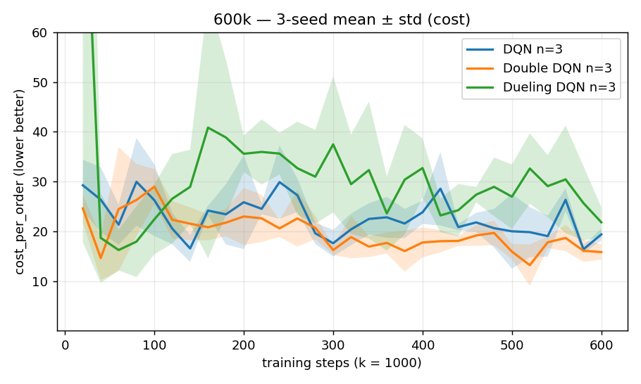
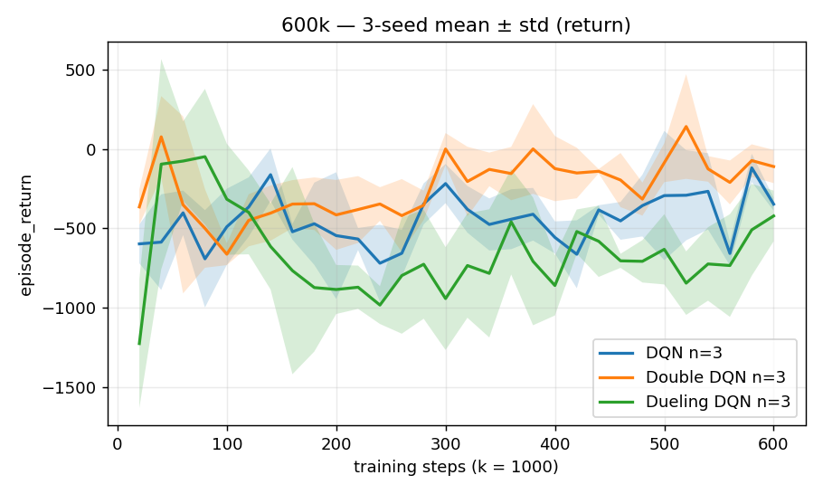
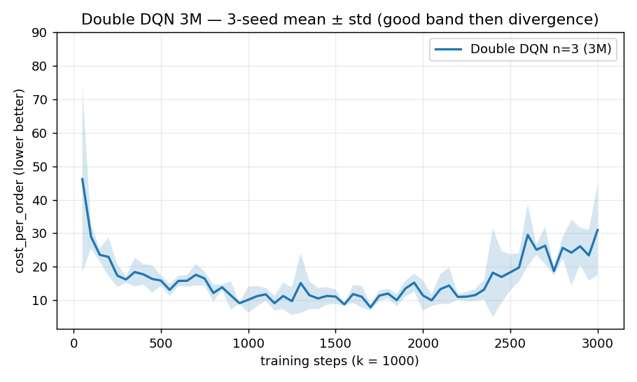
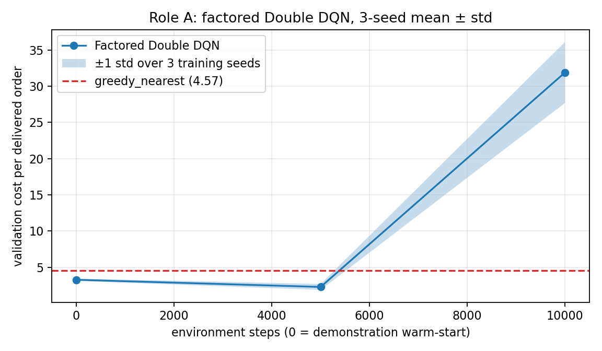
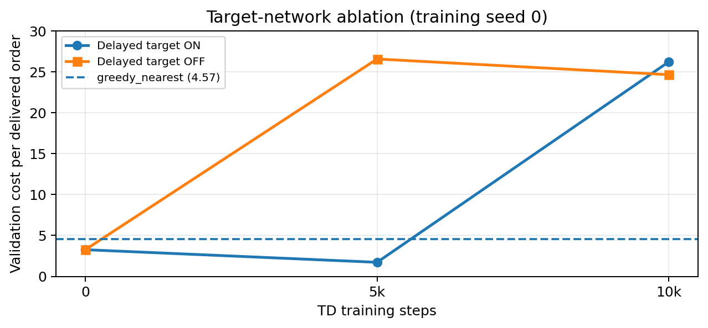
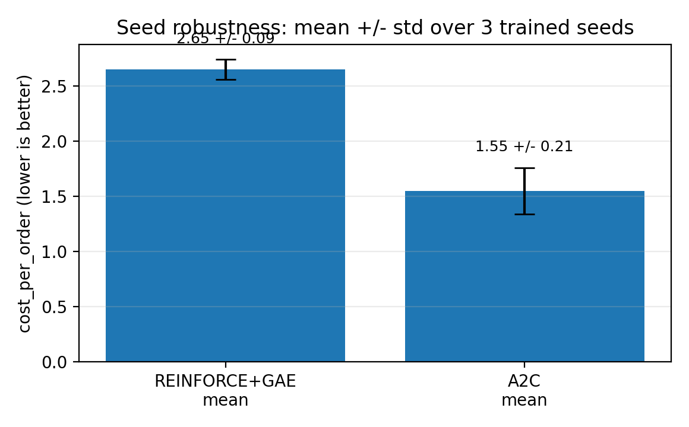
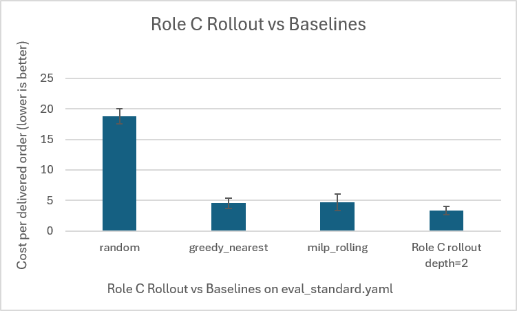
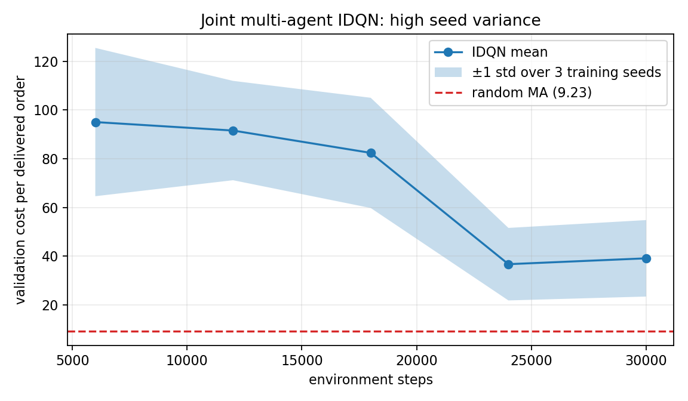

**Role A - Value-Based Methods \| Sezen Balkan 220106006033 \| https://github.com/sezenbalkan/IE_306_Drone_Dispatch**

#  Role A 

##  Flat DQN, Double DQN and Dueling DQN

In the first model the drones, the orders, the grid and time dimensions were flattened to generate one 581 dimensional vector which generated one Q-value for all 169 actions. All the invalid actions were masked during both epsilon-greedy action selection and the Bellman update. All three versions of the algorithm used the same replay memory, Smooth L1 loss, gradient clipping and three step return.

*DQN: y = R(n) + gamma\^n (1-d) max_a Q_target(s\',a)*

*Double DQN: a\* = argmax_a Q_online(s\',a), y = R(n) + gamma\^n (1-d) Q_target(s\',a\*)*

*Dueling DQN: Q(s,a) = V(s) + A(s,a) - mean_a A(s,a)*

DDQN takes the selection and evaluation of actions separately, something that is supposed to mitigate the max operator\'s overestimation problem. Dueling DQN on the other hand distinguishes the state value from the value of the action taken within the state. In this scenario, the effectiveness of the assignment is highly dependent on the specific pair of drone and order, making the simple dueling architecture useless for the task.

##  Factored Double DQN

The flat output couldn\'t share information between similar assignments. The final model used a shared scoring network for each drone order pair and separate heads for charging and no op. Pair features include routed pickup and delivery distance, battery feasibility and margin, remaining deadline, state of charge and global demand. This representation clearly shows the relationships that decide if an assignment is feasible and urgent. The factored network was warm started by supervised imitation of the Role C depth 1 planner. It was then improved with replay based Double-DQN updates. The demonstration score and the TD-learning improvement are reported separately to highlight the contribution of the value updates.

  -------------------------------------------------------------------------
  **Setting**              **Flat family**        **Factored Double DQN**
  ------------------- -------------------------- --------------------------
  Network                    MLP 256-256           Shared scorer 128-128

  Replay / batch            100,000 / 128              100,000 / 128

  Discount / return         0.99 / 3-step              0.99 / 1-step

  Learning rate                  1e-4                       3e-4

  Target update           Every 1,000 steps          Every 1,000 steps

  Validation               Every 20k steps             Every 5k steps
  -------------------------------------------------------------------------

##  Comparison of the Flat Value Based Models

The learning curves average over 3 independent training seeds. Table 3 differentiates between the best validation checkpoint and the last evaluation. This matters as a model may achieve a useful policy temporarily and then degrade as bootstrapped Q targets are estimated poorly.

  ----------------------------------------------------------------------------
  **Method**                    **Best validation cost**     **Final cost**
  ---------------------------- -------------------------- --------------------
  DQN, 600k                           13.87 ± 0.71            19.37 ± 1.19

  Double DQN, 600k                    9.97 ± 0.18             15.81 ± 1.53

  Dueling DQN, 600k                   13.17 ± 6.43            21.80 ± 3.02

  Double DQN, 3M                      6.39 ± 0.41            31.00 ± 13.38
  ----------------------------------------------------------------------------

  ------------------------------------------------------------------------------------------------------------------------------------------------------------------------------------------------
  {width="2.3357458442694665in" height="1.4014479440069991in"}   {width="2.162397200349956in" height="1.2974376640419947in"}
  ------------------------------------------------------------------------------------------------ -----------------------------------------------------------------------------------------------

  ------------------------------------------------------------------------------------------------------------------------------------------------------------------------------------------------

Figure 1. Flat DQN family over 600k steps: validation cost per order (left) and episode return (right), mean ± std over three training seeds.

#  From Flat Double DQN to Factored Double DQN

  -------------------------------------------------------------------------------------------------------------------------------------------------------------------------------------------------
  {width="2.4068416447944005in" height="1.4441043307086614in"}   {width="2.3230107174103236in" height="1.3550896762904636in"}
  ------------------------------------------------------------------------------------------------ ------------------------------------------------------------------------------------------------

  -------------------------------------------------------------------------------------------------------------------------------------------------------------------------------------------------

Figure 2. Extended flat Double DQN (left) and factored Double DQN (right). The dashed line in the factored plot is the greedy_nearest benchmark.

  ----------------------------------------------------------------------------------------------------------
  **Factored model stage**    **Cost/order across training seeds**             **Interpretation**
  -------------------------- -------------------------------------- ----------------------------------------
  Warm start, 0 TD steps                  3.28 ± 0.16                Planner imitation already beats greedy

  5,000 TD steps                          2.29 ± 0.41                   About 30% lower than warm start

  10,000 TD steps                         31.90 ± 4.22                        Late TD instability
  ----------------------------------------------------------------------------------------------------------

The factored architecture made a difference because it applied the same scoring function to all pairs of drones and orders. A valid short distance assignment for one pair could teach the network something it needed for another pair. In fact, the battery and deadline features were quite helpful as they eliminated the need for the model to learn feasibility implicitly from hundred of flattened inputs. This should also account for why the started policy starts below the greedy policy and why a small amount of TD training gets the costs even lower.

While the 3.28 ± 0.16 to 2.29 ± 0.41 gain occurred at all 3 training seeds (3.26 → 1.72, 3.09 → 2.65, 3.49 → 2.50), and TD training adds value above imitation the jump to 31.90 ± 4.22 by 10,000 steps suggests that the representation is solved at least as much as the instability problem in TD. This is why I chose only to save checkpoints with improved validation loss; all three runs saved their 5,000 step checkpoint.

My final run_all.py output tests seed 0 of the best training runs (seed 0) on environment seeds 0--2. It achieves 1.72 ± 0.05 cost/order and 0.914 success. Note that this standard deviation (0.05) is for testing variations among environment seeds, whereas 2.29 ± 0.41 is variation among three training runs.

## Generalization Check

  ----------------------------------------------------------------------------------
  **Evaluation**                       **Factored Double DQN**   **greedy_nearest**
  ----------------------------------- ------------------------- --------------------
  Held-out seeds 5-7                         1.69 ± 0.67            3.19 ± 0.51

  Stress config (24 x 24, k_max=28)         11.19 ± 0.56            12.02 ± 1.12
  ----------------------------------------------------------------------------------

Similarly, the held out data validates the same causality. This is because the factored model uses shared parameter values to score both entities and pairs and does not use a specific grid vector dimension and number of order slots in its weight vector. Hence it is generalizable to the bigger stress configuration whereas the flat neural nets are hardcoded with a specific input and output dimension.

# Target Network Ablation and Final Assessment

{width="4.498801399825022in" height="2.0909919072615923in"}

Figure 3. Target-network ablation on the shipped factored method. Both runs use training seed 0 and the same warm start; only the target-update delay changes.

  -------------------------------------------------------------------------
  **Target setting**             **Step 0**    **Step 5k**    **Step 10k**
  ---------------------------- -------------- -------------- --------------
  Delayed target ON                 3.26           1.72          26.23

  Delayed target OFF                3.26          26.57          24.65
  -------------------------------------------------------------------------

In the setting with delayed target model cost reduced from 3.26 to 1.72 at 5k steps. When we update target from online target every step the cost in that period became 26.57. The causal argument is as in usual DQN: changing target slowly helps train stable regression problem where constantly moving target can let estimation error infect future update directly. Given that we make model both worse in both setting when run for 10k steps, it means delay helps delay instability not solve it.

This ablation is run only using 1 training seed so it can not be interpreted as complete statistic comparing but can be interpreted as a diagnostic experiment. Despite that it also shows that it's useful to store some checkpoint in final run but it seems not in no delay version.

##  Overall Comparison and Limitations

There are several findings which are linked together in order of appearance. Double DQN was better than DQN and Dueling DQN since it fixed overestimation problem, while all flat architectures stayed higher than greedy_nearest. Secondly, extending training did not solve the problem and the late divergence appeared which means that the representation problem and bootstrapping were the main issues here. Thirdly, factored pair scoring provided missing relational structure and lowered the cost below greedy one. Lastly, the ablation proved that delayed target network was needed to keep improvement and select a correct checkpoint.

This approach has several weaknesses. It requires Role C demonstration warm start and the best policy is chosen by validation checkpointing. Also, there is only one training seed for target network ablation. These aspects are mentioned explicitly. The individual contribution of the Role A is the flat DQN, Double DQN and Dueling DQN models; the factored Q scoring model; the Double DQN improvement on the demonstrator using replay and instability analysis.

## Method Origins

DQN was selected as the canonical replay and target network value method (Mnih et al., 2015). Double DQN was added to reduce max operator overestimation (van Hasselt et al., 2016), and Dueling DQN was tested to separate state value from action advantage (Wang et al., 2016). The move from a flat action head to shared pair scoring follows the large and factored action space literature, which argues that structured action representations improve generalization across related actions (Dulac-Arnold et al., 2015; Sharma et al., 2017).

**References**: Mnih et al. (2015), Nature 518; van Hasselt, Guez and Silver (2016), AAAI; Wang et al. (2016), ICML; Dulac-Arnold et al. (2015), arXiv:1512.07679; Sharma et al. (2017), arXiv:1705.07269. Experimental values are taken from the repository logs and YAML configurations.

## 

## 1. Problem Description for Role B -- Ozan Karhan 200106006005-https://github.com/ozankarhan/rl-project

The main problem in this project is to control a fleet of delivery drones in a city grid. The drones must pick up orders, deliver them before their deadlines, and also manage their batteries by going to charging stations when needed.

My role focuses on the learning-based decision part of this problem. In every step, the agent must decide what action should be taken: which drone should take which order, which drone should charge, or whether the system should wait. This is difficult because orders arrive randomly, drone batteries decrease over time, and some areas cannot be crossed because of no-fly zones.

For Role B, the main goal is to train policy-based reinforcement learning agents that can make better dispatch decisions than the greedy baseline. The greedy method usually chooses the nearest available drone, but it does not always think about future battery problems or dropped orders. Because of this, it can still cause drone depletion and missed deliveries.

## 2. Baseline Results

First, I compared against the given baselines. The table below shows the standard evaluation result with seeds 0-4.

+------------------+------------------+---------------+-------------+-------------------+----------------+--------------------+
| > **Policy**     | > **Cost/order** | > **Success** | **On-time** | **Depletions/ep** | **Dropped/ep** | > **Delivered/ep** |
+==================+==================+===============+=============+===================+================+====================+
| > Random         | > 18.498         | > 0.659       | 0.897       | > 8.00            | > 21.2         | > 40.0             |
+------------------+------------------+---------------+-------------+-------------------+----------------+--------------------+
| > Greedy nearest | > 4.309          | > 0.858       | 0.906       | > 3.60            | > 19.8         | > 120.0            |
+------------------+------------------+---------------+-------------+-------------------+----------------+--------------------+
| > MILP rolling   | > 4.282          | > 0.853       | 0.910       | > 3.20            | > 20.6         | > 120.6            |
+------------------+------------------+---------------+-------------+-------------------+----------------+--------------------+

The random policy is very bad. Greedy_nearest and milp_rolling are much stronger. So, the real target for my part was to beat greedy_nearest, not only random.

## 3. Methods Used in Role B

I used three learning methods. I tried to keep the design practical for this simulator:

3.1 REINFORCE + GAE

REINFORCE is a policy-gradient method. It tries actions, observes the episode result, and then increases the probability of useful actions. I added GAE because it helps the method use the value function and makes learning less noisy.

At first, REINFORCE was not stable. Some seeds learned badly. To fix this, I used a greedy warm-start. This means the policy first learned to copy greedy_nearest a little, then improved from there. After this, REINFORCE became more reliable.

3.2 A2C

A2C is an actor-critic method. The actor chooses the action, and the critic estimates how good the current state is. This made training more stable than pure REINFORCE.

A2C was the best method in my dispatch results. It delivered more orders and dropped fewer orders than greedy_nearest.

3.3 DDPG

DDPG was not used for the main dispatch environment. It was used for the continuous control sub-environment. In this environment, the agent controls movement, like speed and heading. This is why DDPG is a suitable choice.

The comparison baseline for DDPG was a go-straight controller. DDPG learned to avoid bad movement better and reached the target more successfully.

## 4. Main Dispatch Results

The table below compares the baselines with my Role B methods. The important result is that both REINFORCE + GAE and A2C beat greedy_nearest on cost_per_order.

  --------------------------------------------------------------------------------------------------------
  **Policy**        **Cost/order**   **Success**   **Depletions/ep**   **Delivered/ep**   **Dropped/ep**
  ----------------- ---------------- ------------- ------------------- ------------------ ----------------
  Random            18.498           0.659         8.00                40.0               21.2

  Greedy nearest    4.309            0.858         3.60                120.0              19.8

  MILP rolling      4.282            0.853         3.20                120.6              20.6

  REINFORCE + GAE   2.565            0.907         1.80                128.8              13.4

  A2C               1.735            0.955         1.60                134.0              6.4
  --------------------------------------------------------------------------------------------------------

A2C was the best one. Its cost_per_order was 1.735, while greedy_nearest was 4.309. This is a large improvement. A2C also delivered more orders and dropped fewer orders.

The improvement mainly comes from fewer dropped orders and fewer battery depletion events. A2C did not only improve the cost number; it also behaved more safely with the drones.

5\. Seed Robustness

Both methods stayed better than greedy_nearest in all three trained seeds. This makes the result more trustworthy than only reporting one best run.

{width="3.199507874015748in" height="1.9859033245844269in"}

## 6. DDPG Control Result

DDPG was tested in the continuous control sub-environment. This is separate from the main dispatch table. The baseline here is go-straight.

  --------------------------------------------------------------------------
  **Policy**             **Return**      **Success rate**   **Mean steps**
  ---------------------- --------------- ------------------ ----------------
  Go-straight            -417.4          0.80               28.4

  DDPG                   +20.7           1.00               17.0
  --------------------------------------------------------------------------

DDPG reached the target in all evaluation episodes. It also had a positive return, while go-straight had a very negative return because it crashed or made unsafe moves more often.

7\. Ablation Study: GAE Lambda

The required ablation for Role B was a GAE lambda sweep. I tested different lambda values in A2C. This shows how the choice of lambda changes the result.

  -----------------------------------------------------------------------
  **GAE lambda**                 **Mean best cost/order**
  ------------------------------ ----------------------------------------
  0.0                            13.85

  0.9                            0.75

  0.95                           0.69

  0.99                           0.80

  1.0                            1.11
  -----------------------------------------------------------------------

The best result was around lambda = 0.95. Very small lambda was too short-sighted. Very high lambda was more noisy. So, 0.95 was a good balance in this project.

## 8. What Broke and How I Fixed It

1.  During the project, some parts did not work well at first. REINFORCE was unstable because some random seeds could not learn good delivery behavior. To make it more stable, I used a greedy warm-start before the main training.

2.  Another problem was that the value loss became too large. This made the critic dominate the learning process, so the policy could not improve properly. I fixed this by using reward scaling and Huber loss.

3.  For DDPG, the agent sometimes preferred not to move enough because risky movement could cause to bad penalties. For solve this, I used exploration noise and a minimum speed floor. Also, I noticed that a fixed output model could fail when the action count changed in different configurations. Therefore, I used a more flexible policy design that scores possible actions separately.

## 9. Method Origin Note

I used these methods because they match the type of environment I worked on.

- REINFORCE: Williams (1992). I used it as the basic policy-gradient method.

- GAE: Schulman et al. (2016). I used it to make advantage estimates more useful.

- A2C: based on the actor-critic idea from Mnih et al. (2016). I used it for more stable learning than REINFORCE.

- DDPG: Lillicrap et al. (2016). I used it because the control sub-env has continuous actions.

- TD3: Fujimoto et al. (2018). It was added as a stabilizer for DDPG-style training.

## 10. Conclusion for Role B

In my Role B part, I trained and evaluated policy-based RL methods for the drone delivery project. The main dispatch methods were REINFORCE + GAE and A2C. A2C gave the best result in my section.

The main result is simple: learned policies can beat greedy_nearest when they learn to avoid dropped orders and battery depletion. A2C reduced cost_per_order from 4.309 to 1.735 in the reported standard evaluation.

DDPG also worked well in the control sub-environment. It reached 100% success in the reported evaluation and improved return compared with go-straight.

Overall, Role B was successful because the learned methods improved the main evaluation metric and the experiments were tested with multiple seeds, tables, and ablation results.

## Role C : Planning-Based Rollout Agent

## Tuba Nur Büyükata-200106006009 - https://github.com/runabuyukata/IE_306_Drone_Dispatch\...

## Problem Introduction

In this project, the simulator models a city-scale drone delivery system with stochastic orders, drone batteries, charging hubs, no-fly zones, and delivery deadlines. The operational problem is to decide, in real time, which drone should serve which order, when a drone should charge, and how drones should be positioned for future demand.

My part of the project was Role C, which focuses on planning methods. For this role, we implemented a rollout/lookahead-based planning agent. The main objective was to get better the dispatch decisions compared with the greedy_nearest base. In this environment, simply selecting the nearest order is not always enough because the closest order may cause a late delivery, battery risk, or poor positioning after the delivery.

## Method Overview

The Role C agent uses a rollout-style planning rule. At each decision step, the agent checks the valid actions and scores possible dispatch or charging decisions. The action with the best planning score is selected.

The planner doesn't only consider the closest pickup distance. It also considers the full delivery route, deadline pressure, battery feasibility, order waiting time, and post-delivery charging position. Therefore, the planner is less short-sighted than the greedy_nearest baseline.

The main factors are shown below.

  -------------------------------------------------------------------------------------------
  **Factor**                        **Purpose**
  --------------------------------- ---------------------------------------------------------
  Pickup distance                   Avoids unnecessary long travel to pick up an order

  Delivery distance                 Considers the full pickup-to-dropoff trip

  Deadline risk                     Penalizes actions that may lead to late delivery

  Battery feasibility               Reduces risky assignments with low battery

  Order age                         Gives some priority to waiting orders

  Post-delivery charging distance   Helps the drone remain better positioned after delivery
  -------------------------------------------------------------------------------------------

## Configuration and Depth Selection

The final Role C configuration uses selected_depth=2. This means the planner does not only evaluate the immediate dispatch action, but also includes a shallow future-awareness term related to the drone's post-delivery charging position.

Depth 2 is a reasonable choice for this problem because battery and charging decisions affect later performance. A one-step greedy decision may look good immediately but may leave the drone far from a charger or in a weak position for the next order. However, the depth was not

increased further because deeper search can become slower and may overfit to the released evaluation setting.

It is also important that the depth is read from the configuration file instead of being hard-coded inside run_all.py. If depth were fixed inside the script, then changing the config would not actually change the experiment. Keeping selected_depth in configs/role_c_rollout.yaml makes the method easier to reproduce, check, and modify.

Ablation: Rollout Depth Selection

The main ablation for Role C is the rollout depth. The final configuration uses selected_depth=2 because it adds a simple future planning term related to the drone's post-delivery charging position. This is useful in the drone delivery environment because a dispatch action that looks good immediately can leave the drone far from a charger after delivery. Depth 2 was selected as a practical balance between short-horizon planning and computational simplicity. We did not fix this value inside the code this value in run_all.py so we can use the same test script again with different depth settings.

## Experimental Setup

The final integrated evaluation was run with \`python run_all.py\`.

The evaluation used configs/eval_standard.yaml with seeds \[0, 1, 2\]. The primary metric is cost_per_order, where lower values indicate better performance. The Role C planner was compared with the standard baselines, especially greedy_nearest, because the project requirement is to improve over this baseline on mean cost per delivered order.

The test command \`python -m pytest -q\` returned 17 passed in 15.36s. This shows that the tested code paths and interfaces run correctly. However, passing tests doesn't prove that the planner is optimal or exactly true to perform best on hidden settings.

## Results and Baseline Comparison

The final results are shown in Table X.

  --------------------------------------------------------------------------
  **Policy**                  **Cost/order mean ± std**   **Success rate**
  --------------------------- --------------------------- ------------------
  random                      18.78 ± 1.27                0.653

  greedy_nearest              4.57 ± 0.85                 0.855

  milp_rolling                4.72 ± 1.38                 0.836

  Role C rollout depth=2      3.33 ± 0.71                 0.869
  --------------------------------------------------------------------------

**Table X.** Baseline comparison on configs/eval_standard.yaml using seeds \[0, 1, 2\].

The same comparison is visualized in Figure X. Since cost_per_order is a cost metric, lower values are better.

{width="2.63294072615923in" height="1.584877515310586in"}

**Figure X.** Cost per delivered order comparison on configs/eval_standard.yaml with seeds \[0, 1, 2\]. Lower cost/order is better. Role C rollout depth=2 achieved 3.33 ± 0.71 cost/order, while greedy_nearest achieved 4.57 ± 0.85.

The Role C rollout planner improved the primary metric compared with greedy_nearest on the reported evaluation setting. The cost/order decreased from 4.57 ± 0.85 to 3.33 ± 0.71, which corresponds to about a 27% reduction. The success rate also increased a little from 0.855 to 0.869.

**Discussion and Limitations**

These results indicate that even a simple look ahead can improve the greedy dispatch rule in this evaluation setting. The planner performs better than greedy_nearest because it considers deadline risk, battery feasibility, and future charging position in addition to immediate distance.

However, the method is still heuristic. The scoring factors are manually designed, so the method may not generalize perfectly to every demand pattern, city layout, or battery setting. Also, the reported result is based only on eval_standard.yaml and seeds \[0, 1, 2\]. Therefore, we should not say that Role C is the best overall method or that it will always beat the baseline on hidden seeds. The true conclusion is that Role C improves over greedy_nearest on the reported evaluation setting.

**Short Conclusion**

For Role C, we implemented a rollout/lookahead-based planning agent with selected_depth=2. On the reported evaluation setting, the method achieved 3.33 ± 0.71 cost/order, while greedy_nearest achieved 4.57 ± 0.85. This shows that simple planning can improve the greedy dispatch rule in this drone delivery environment.

**Joint component Offline RL**

This pooled data comprises 420,103 transitions from 3,969 episodes. The checksum and validation command for the dataset are at DATASET.md. It encompasses trajectories from all three role policies and comprises mixed-quality behavior.

The simple offline DQN applies Bellman regression onto the fixed dataset. Lacking any masks in the dataset, it takes its max range over all 169 actions, which are not all valid. The CQL policy adds (logsumexp Q(s,a) Q(s,a_data)); BC simply clones the behavior-generated action at (s).

  ------------------------------------------------------------------------
  Method                    cost/order, 3 training seeds           success
  ---------------------- ------------------------------- -----------------
  BC                                        18.45 ± 3.79     0.542 ± 0.058

  naive offline DQN                         13.96 ± 2.72     0.537 ± 0.055

  CQL                                        7.06 ± 1.10     0.717 ± 0.030

                                                         
  ------------------------------------------------------------------------

{width="6.675in" height="2.975in"} Both offline baselines are inferior to CQL. The chosen CQL seed achieved 5.72. Naive maximum values for final Q were around 6,785, 4,170, and 5,982; CQL lowered those values to 839, 792, and 745, respectively. This shows that the OOD over-estimation problem exists in all seeds during training

The first shows max Q versus training (seed 0, typical), and as we'd expect, naive Bellman overshoots to 6000+ by continually bootstrapped from off-distribution, overoptimistic values, while CQL's penalty clamps max Q near 800, and BC gets near 0. This needed showing in terms of a picture for the overestimation failure and success to avoid. CQL will not get over greedy_nearest (7.06 versus 4.57), which it will not the maximum you can get out of a log created 60% of the time by a 60% probability or maybe 70% greedy policy (and 30% by randomness/some of these values taken uniformly or near greedily is about 60% value if greedy is around .08, it is only 06 value in the log).CQL crushes naive-DQN-offline, as it must: The necessary comparisons however are shown in the second figure: Naïve DQN offline and BC both of which are destroyed by CQL.Joint component Multi agent IDQN.

Eight decentralized drones share one Q-network and one reply buffer on DroneDispatchMA-v0 environment. Every drone has access to local state observation with dimension of 59 and makes an action out of accept, move, charge, or idle. Cost function has been updated to count actual late deliveraies according to original deadlines rather than the prior threshold as penalty.

We used 3 training runs of 30k steps for the training process for each of three equal random initializations.

We observed the following training outcomes:

  ------------------------------------------------------------------------
          training seed             cost/order           delivered/episode
  --------------------- ---------------------- ---------------------------
                      0                  55.33                        26.0

                      1                  44.17                        30.3

                      2                  17.90                        71.7

         **mean ± std**      **39.14 ± 15.69**             **42.7 ± 20.6**
  ------------------------------------------------------------------------

The randomized MA baseline is priced at 9.23, so these fixed-budget runs did not converge. An earlier seed-0 checkpoint at 60k extends, cost 6.65, generated 100.7 orders and was better than random, but isn't treated as a reliable 3-seed run and falls short of the best central A2C (1.09) and Role-C planner (2.92). This fixes the earlier statement to the effect that IDQN often beat the centralized policy.

{width="7.025in" height="2.8583333333333334in"}

The high variance illustrates nonstationarity: from one drone's perspective, the other seven agents change their behavior while the shared network learns. Parameter sharing reduces but does not remove this moving-target problem.

**\
Reproducibility and final assessment**

Experimental values in all YAML configs; dependencies are pinned. Checksums of offlinepool.npz available using SHA-256. Runall.py is a script which loads final saved policies of all four roles and two joint controllers; simulator passes all 17 tests. Among the tested algorithms, A2C, double factored DQN, and depth-1 planner work the best. Currently, the DDPG agent surpasses the naïve go-straight policy regarding success rate (reach success 100% in test range); offline CQL is capable of conducting failure and fix tests of the specified type. Three seeds\' IDQN is a reliable negative result algorithm which works end-to-end and is just better than random at 60k timesteps but fails to converge to central policy.
